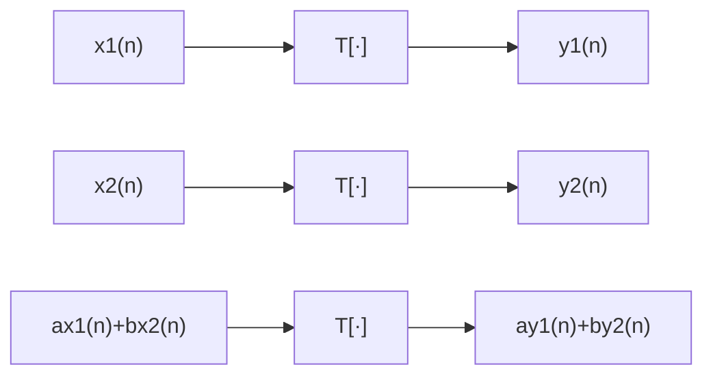
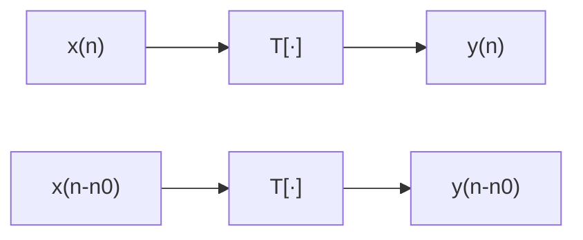

## 第一章 离散时间信号与系统

### 1.1 符号表示及基础

离散时间信号通常用序列：
$ \{x(n)\}$ ，$ n $ 为 $ 0,1,2 ...$ , $ x(n) $ 表示为序列中第 $ n $ 个样本值。

$ \{·\} $ 表示全部样本值的集合

$ \{x*(n)\}$ 表示复序列的共轭

连续时间序列 $ x\{t\} $ 与离散时间序列 $ \{x(n)\}$ 的关系：

$$
x(n) = x_a(t) |_{t = nT} =x_a(nT) \tag {1.1}
$$
其中采样频率$ f_s = \frac{1}{T} $（T为采样周期，即两个样本间的时间间隔）

周期序列表示为 $ \widetilde{x}(n) $
其中
$$
\widetilde{x}(n) = x(n+kN) , 0 \leq n \leq N-1 ,k为任意整数 \tag{1.2}
$$

#### 1.1.1 常见典型序列

1. 单位脉冲序列
$$
\delta (n)=\left \{
\begin{aligned}
1, n = 0\\
0, n \neq 0 \\
\end{aligned}
\right. \tag{1.3}
$$

2. 单位阶跃序列
$$
u (n)=\left \{
\begin{aligned}
1, n \geq 0\\
0, n < 0 \\
\end{aligned}
\right. \tag{1.4}
$$

3. 矩形序列
$$
R_N (n)=\left \{
\begin{aligned}
1, n \leq n \leq N-1 \\
0, n < 0,n \geq N \\
\end{aligned}
\right. \tag{1.5}
$$

4. 实指数序列
$$
x(n) = a^n u(n) \tag{1.6}
$$

$ a \neq 0, |a| < 1 $ 时收敛，$|a| \geq 1$ 时发散

5. 正弦序列
$$
x(n) = sin(\omega_0n)
\tag{1.7}
$$
$\omega_0$为数字角频率，单位为弧度 $rad$

6. 复指数序列

$$x(n) = (re^{j\omega_0})^n = r^n[cos(\omega_0n)+jsin(\omega_0n)]
\tag{1.8}
$$

#### 1.1.2 序列的运算

1. 序列的加法
$$
z(n) = x(n) + y(n) \tag{1.9}
$$

2. 序列的相乘
$$
z(n) = x(n)  y(n) \tag{1.10}
$$

3. 序列的位移
$$
z(n) = x(n-n_0) \tag{1.11}
$$
当 $ n_0 > 0 $ 时 $z(n)$ 是 $ x(n) $ 的延迟；当 $ n_0 < 0 $ 时 $z(n)$ 超前于 $ x(n) $ ；

4. 序列的能量及序列的绝对值
序列的能量定义为序列样本值的平方和
$$
S = \sum^{\infty}_{n = -\infty} |x(n)|^2
\tag{1.12}
$$
如果序列 $x(n)$ 满足 $S < \infty$ 则为平方可和序列
如果序列满足
$$
\sum^{\infty}_{n = -\infty} |x(n)| < \infty \tag{1.13}
$$
则为绝对可和序列
如果序列的每一个样本值的绝对值均小于某一个有限的正整数 $B_x$ 则 $x(n)$ 为有界序列，即
$$
|x(n)| \leq B_x < \infty
\tag{1.14}
$$

5. 实序列的偶部和奇部
任何序列均可以分解成偶对成序列和奇对称序列的和的形式，即
$$
x(n) = x_e(n) + x_o(n)
\tag{1.15}
$$
$x_e(n)$ 和 $x_o(n)$ 分别称为 $x(n)$ 的偶部和基部，其分别等于
$$
x_e(n) = \frac{1}{2}[x(n) + x(-n)]
\tag{1.15a}
$$
$$
x_o(n) = \frac{1}{2}[x(n) - x(-n)]
\tag{1.15b}
$$

6. 任意序列的单位脉冲表示
任一序列 $x(n)$ 都可以表示成单位脉冲序列移位的加权和，即
$$
x(n) = \sum^{\infty}_{m = -\infty}x(m)\delta(n-m)
\tag{1.16}
$$

### 1.2 离散时间信号的傅里叶变换与 $ z $ 变换

#### 1.2.1 离散时间信号的傅里叶变换

离散时间傅里叶变换 $ DTFT $ (discrete-time Fourier tansform) ,序列的 $DTFT$ 定义为：
$$
X(e^{j\omega}) = \sum^{\infty}_{n = -\infty}x(n)e^{-j\omega n},\omega = \frac{2\pi f}{f_S}
\tag{1.17}
$$
式中， $ \omega $ 为数字角频率，它是频率 $f$ 对采样频率 $f_s$ 作归一化后的角频率。
$X(e^{j\omega})$ 时 $\omega$ 的连续函数，且周期为 $2\pi$
式（$1.17$）级数不一定总是收敛的，当 $x(n)$ 绝对可和时，它的 $DTFT$ 一定存在。
离散时间信号的傅里叶逆变换（$IDTFT$）：
$$
x(n) = \frac{1}{2\pi}\int_{-\pi}^{\pi} X(e^{j\omega})e^{j\omega m} d\omega
\tag{1.18}
$$
$x(n)$ 和 $X(e^{j\omega})$ 对应关系可表示为：$X(e^{j\omega}) = DTFT[x(n)]$ ,$x(n)=IDTFT[X(e^{j\omega})]$

$X(e^{j\omega})$ 的几种表示方法：
$$
X(e^{j\omega}) = Re[X(e^{j\omega})]+jIm[X(e^{j\omega})] = |X(e^{j\omega})|e^{j\phi(\omega)}
\tag{1.19}
$$
$Re[·]$ 和 $Im[·]$ 表示取实部和虚部。
$|X(e^{j\omega})|$ 为离散序列 $x(n)$ 的幅度谱，$\phi(\omega)$为离散序列的相位谱。

$DTFT$ 的主要特性
|序列|$DTFT$|
|:---:|:---:|
|$ax(n)+by(n)$|$aX(e^{j\omega})+Y(e^{j\omega})$|
|$x^*(n)$|$X^*(e^{-j\omega})$|
|$x^*(-n)$|$X^*(e^{j\omega})$|
|$x(n-n_0)$|$e^{-jn_0\omega}X(e^{j\omega})$|
|$e^{j\omega_0 n}x(n)$|$X(e^{j(\omega - \omega_0)})$|
|$Re[x(n)]$|$X_e(e^{j\omega})$  [$X(e^{j\omega})$ 的共轭偶对称部分]|
|$jIm[x(n)]$|$X_o(e^{j\omega})$ [$X(e^{j\omega})$ 的共轭奇对称部分]|
|$x(n)$ 为实序列|$X(e^{j\omega}) = X^*(e^{-j\omega})$
||$Re[X(e^{j\omega})] = Re[X(e^{-j\omega})]$|
||$Im[X(e^{j\omega})] = -Im[X(e^{-j\omega})]$|
||$arg[X(e^{j\omega})] = -arg[X(e^{-j\omega})]$|
|$x_e(n)$ [$x(n)$ 的共轭偶对称部分]|$Re[X(e^{j\omega})]$|
|$x_o(n)$  [$x(n)$ 的共轭偶奇称部分]|$jIm[X(e^{j\omega})]$|

#### 1.2.2 $z$变换

序列 $x(n)$ 的 $z$ 变换定义为：
$$
X(z) = \sum^{\infty}_{n = -\infty}x(n)z^{-n} ,(n = 0时为单边z变换)
\tag{1.20}
$$
上式中 $z$ 为复变量，也可记为 $\mathscr{Z}[x(n)] = X(z)$
对于所有的序列或所有的 $z$ 值，$z$变换并不总是收敛，使 $z$ 变换收敛的 $z$ 值的集合称作收敛区域，一般为 $z$ 平面上的一个环形区域，该区域为:
$$
R_{x^-} <|z|<R_{x^+}
\tag{1.21}
$$
其中 $R_{x^-}$ 可以小到0，$R_{x^+}$ 可以大到 $\infty$

以下讨论几种序列的收敛域

1. 有限长序列
仅有有限个数的序列值是非零值，从而有:
$$
X(z) = \sum^{n_2}_{n = n_1} x(n) z^{-n}
\tag{1.22}
$$
其中 $n_1,n_2$ 为有限整数，分别为 $x(n)$ 的起点和终点。除了当 $n_1 < 0$ 时 $z = \infty$ 以及 $n_2>0$ 时 $z=0$ 之外， $z$ 所在的区域均收敛，即有限长序列的收敛区域至少是：
$$
0<|z|<\infty
$$
其收敛区域可能包括 $z=0$ 或包括 $z=\infty$

2. 右边序列
右边序列为 $n<n_1$ 时 $x(n)=0$ 的序列， $z$ 变换为：
$$
X(z) = \sum^{\infty}_{n = n_1} x(n) z^{-n}
\tag{1.23}
$$
右边序列的收敛域是一个半径为 $R_{x^-}$ 的圆的外部，即：
$$
|Z|>R_{x^-}
$$
当 $n_1 \geq 0$ 时 $z$ 变换在 $z = \infty$ 处收敛，反之 $n_1 < 0$ 时 $z$ 变换在 $z = \infty$ 处将不收敛

3. 左边序列
左边序列为 $n > n_2$ 时 $x(n)=0$ 的序列， $z$ 变换为：
$$
X(z) = \sum^{n_2}_{n = -\infty} x(n) z^{-n}
\tag{1.24}
$$
左边序列的收敛域是一个半径为 $R_{x^-}$ 的圆的内部，即：
$$
|z|<R_{x^+}
$$
若$n_2 < 0$ 则左边序列的 $z$ 变换在 $z = 0$ 处将收敛

4. 双边序列
双边序列可视为一个左边序列与一个右边序列之和，其 $z$ 变换的收敛域就是这两个序列 $z$ 变换的公共收敛区间
$$
X(z) = \sum^{\infty}_{n = -\infty}x(n)z^{-n} =\sum^{\infty}_{n = 0} x(n) z^{-n} + \sum^{-1}_{n = -\infty} x(n) z^{-n}
\tag{1.25}
$$
第一个级数是右边序列，对 $|z|>R_{x^-}$ 收敛；第二个级数是左边序列，对 $|z|<R_{x^+}$ 。
若 $R_{x^-} < R_{x^+}$ ，则有一个形式为：
$$
R_{x^-} <|z|< R_{x^+}
$$
的公共收敛区域。若 $R_{x^-} > R_{x^+}$ ，则没有公共收敛区域，因此式（1.25）不能收敛。

#### 1.2.3 逆$z$变换

已知函数 $X(z)$ 及其收敛域，反求序列的变换，其表示及变换关系式（柯西积分定理推导）为：
$$
x(n) = \mathscr{Z}^{-1}[X(z)] = \frac{1}{2\pi j} \oint_C X(z)z^{n-1}dz
\tag{1.26}
$$
式中 $C$ 为 $X(z)$ 收敛域内的一条逆时针方向绕原点的闭合曲线

#### 1.2.4 $z$变换的性质

$z$变换特性表
|序列|$z$ 变换|收敛域|
|:---:|:---:|:---:|
|$x(n)$|$X(z)$|$ R_{x^-} <\|z\|< R_{x^+} $|
|$y(n)$|$Y(z)$|$ R_{y^-} <\|z\|< R_{y^+} $|
|$ax(n)+bx(n)$|$aX(z)+bY(z)$|$max[R_{x^-},R_{y^-}] <\|z\|< min[R_{x^+},R_{y^+}]$|
|$x(n+n_0)$|$z^{n_0}X(z)$|$ R_{x^-} <\|z\|< R_{x^+} $|
|$a^nx(n)$|$X(a^{-1}z)$|$\|a\|R_{x^-} <\|z\|< \|a\|R_{x^+}$|
|$nx(n)$|$-z\frac{dX(z)}{dz}$|$ R_{x^-} <\|z\|< R_{x^+} $|
|$x^*(n)$|$X^*(z^*)$|$ R_{x^-} <\|z\|< R_{x^+} $|
|$x(-n)$|$X(\frac{1}{z})$|$\frac{1}{R_{x^+}} <\|z\|< \frac{1}{R_{x^-}}$|
|$x(n)*y(n)$|$X(z)Y(z)$|$max[R_{x^-},R_{y^-}] <\|z\|< min[R_{x^+},R_{y^+}]$|
|$x(n)y(n)$|$\frac{1}{2\pi j}\oint_CX(v)Y(\frac{z}{v})v^{-1}dv$|$R_{x^-}R_{y^-} <\|z\|< R_{x^+}R_{y^+}$|
|$x(0) = X(\infty)$||$\|z\|>R_{x^-}$|
|$x(\infty) = Res[X(z),1]$||$(z-1)X(z)收敛于\|z\|\geq 1 $|

#### 1.2.5 $z$变换与$DTFT$的关系

$$
X(z)|_{z = e^{j\omega}} =\sum^{\infty}_{n=-\infty}x(n)e^{-jn\omega}
\tag{1.27}
$$
当 $z = e^{j\omega}$ 时，$z$ 变换与 $DTFT$ 相等，即采样序列单位圆上的$z$变换就等于该序列的$DTFT$
由于$e^{j\omega} = e^{j(\omega + 2k\pi)}$ ,所以 $X(e^{j\omega})$ 是以 $2\pi$ 为周期的周期函数， $z$ 平面单位圆上一周正好对应 $X(e^{j\omega})$ 的一个周期。

#### 1.2.6 Parseval 定理

设两个序列 $x(n),y(n)$ 则Paseval定理为：
$$
\sum^{\infty}_{n=-\infty}x(n)y^*(n)=\frac{1}{2\pi j}\oint_CX(v)Y^*(\frac{1}{v^*})v^{-1}dv
\tag{1.28}
$$

上式中，积分围线取在 $X(v)$ 和 $Y^*(\frac{1}{v^*})$ 的收敛区域的交叠范围内。
Parseval定理的一个很重要的应用式计算序列的能量：

$$
\sum^{\infty}_{n=-\infty}|x(n)|^2 = \sum^{\infty}_{n=-\infty}x(n)x^*(n)=\frac{1}{2\pi}\int^\pi_{-\pi}X(e^{j\omega})X^*(e^{j\omega})d\omega = \frac{1}{2\pi}\int^\pi_{-\pi}|X(e^{j\omega})|^2d\omega
\tag{1.29}
$$

### 1.3 离散时间系统

离散时间系统在数学上定义为将输入序列 $x(n)$ 映射成输出序列 $y(n)$ 的唯一性变换或运算，或者说将一个序列变换成另一个序列的系统。表示为：
$$
y(n) = T[x(n)]
\tag{1.30}
$$

算子 $T[·]$ 表示种种约束条件。

#### 1.3.1 线性系统（Linear system）

满足叠加原理的系统具有线性特性。即若对两个激励 $x_1(n)$ 和 $x_2(n)$ 有：
$$
T[ax_1(n)+bx_2(n)] = aT[x_1(n)]+bT[x_2(n)],a,b为任意常数
\tag{1.31}
$$
线性系统满足叠加性原理，不满足上述关系的为非线性系统。

#### 1.3.2 时不变（time-invariant）系统

时不变系统就是系统的参数不随时间而变化，不管输入信号作用的时间先后，输出信号响应的形状均相同，仅出现的时间不同。
$$
T[x(n)] = y(n)
T[x(n-n_0)] = y(n - n_0)
\tag{1.32}
$$

#### 1.3.3 线性时不变（linear time-invariant, LTI）系统

#### 1.3.4 稳定系统（stable system）和因果系统（causal system）

只要输入序列是有界的，其输出必定是有界的，这样的系统称为稳定系统，稳定系统的充要条件是其单位脉冲响应绝对可和，即：
$$
\sum^{\infty}_{n=-\infty}|h(n)|<\infty
$$

因果系统，就是系统的输出只取决于此时以及此时以前的输入（ $x(n),x(n-1),x(n-2)...$ 等）
一个线性时不变系统是因果系统的充要条件是
$$
h(n) \equiv 0,n<0
$$
通常将 $n<0$ 时等于 $0$ 的序列称为因果序列。
